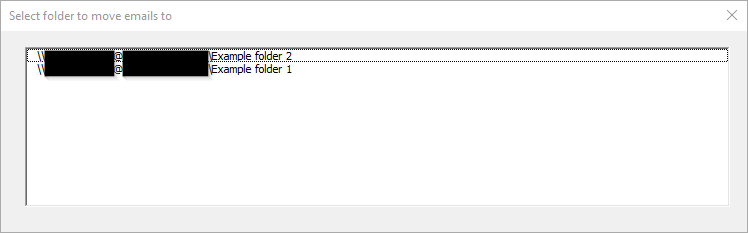

# outlook-move-to-thread
Microsoft Outlook VBA to move emails to the same folder as the rest of the email thread

When this macro is run within the main window of Microsoft Outlook, the user will be prompted with a pop-up containing a list of folders that emails within the thread already reside in, excluding default folders such as "Inbox" and "Sent Items". The user picks a folder from the list and emails will be moved to the selected folder.

If there would only be one folder in the list, then the emails will be moved without prompting the user and the macro displays a message box confirming the move.

## Installation
Open Outlook VBA window using a method such as Alt+F11.

Import files by selecting "File" then "Import File...". Import `ListThread.bas` and `ListThreadFolders.frm`. `ListThreadFolders.frx` must be in the same directory as `ListThreadFolders.frm` when it is imported.

## Usage
Run `LoadUserForm` in `ListThread.bas` to start the macro. It is recommended to create a toolbar shortcut button to this subroutine.

## Limitations
At this stage, folder names need to have only ASCII caracters for the macro to run properly.

## Contributing
Pull requests, issues, and feature suggestions are welcome. All code in pull requests must be tested in Outlook and exported directly from the program to ensure import compatibility.

## Acknowledgements
Much of the code has been copied and edited from various sites and forums. Credit to original sources is given in the code where applicable.
